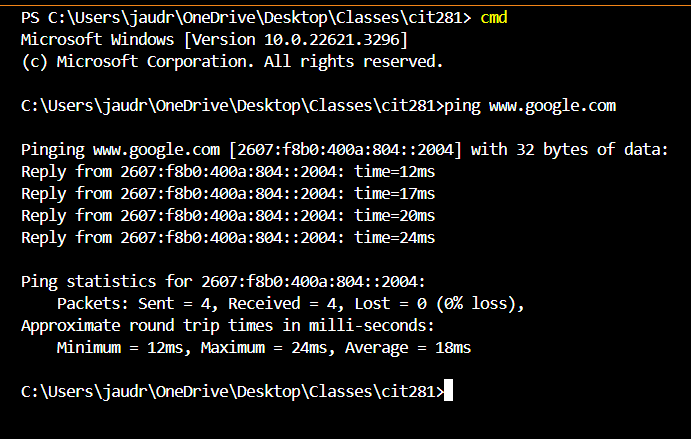

# Project 1 

## Purpose of the project
In this lab I gained experience working in the command line, and executing non-web server Node.js and Javascript code.
## Technologies used 
- Javascript
- VS Code
- Node.js

## What I learned from this Project
During this lab, I learned...
- About the ping command
- Terminal folder display in a tree-like structure
- To write a simple program that returns a random number between min and max
- To test my javascript using Node.js

